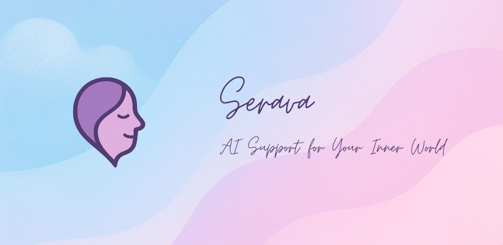
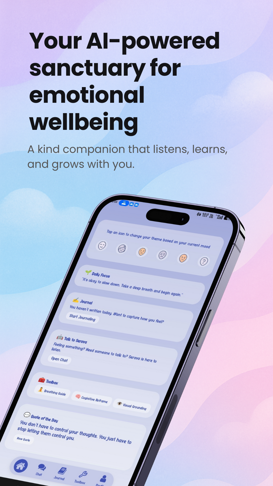
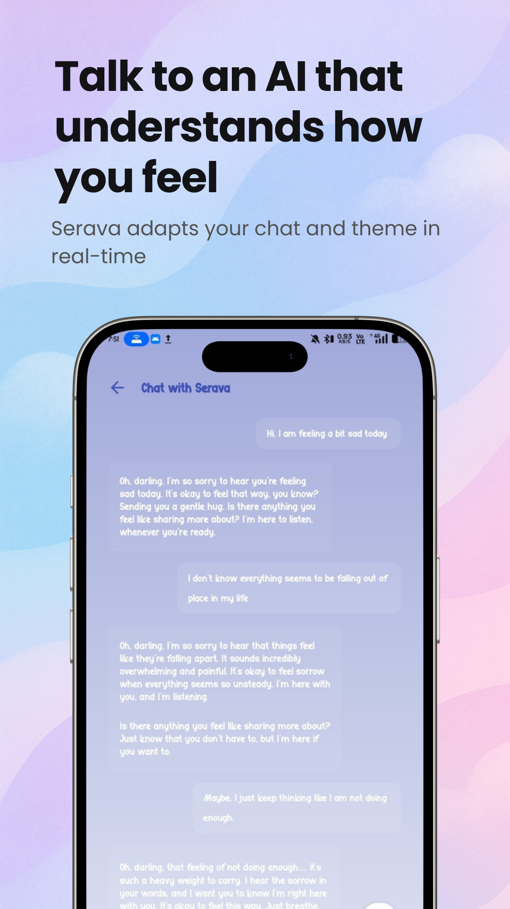
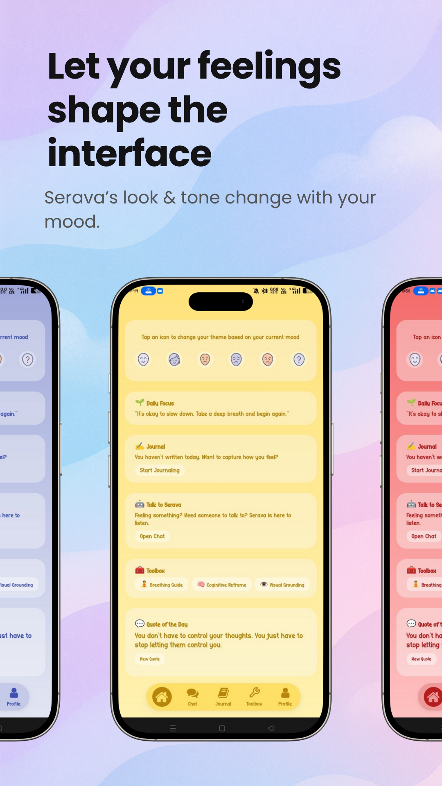
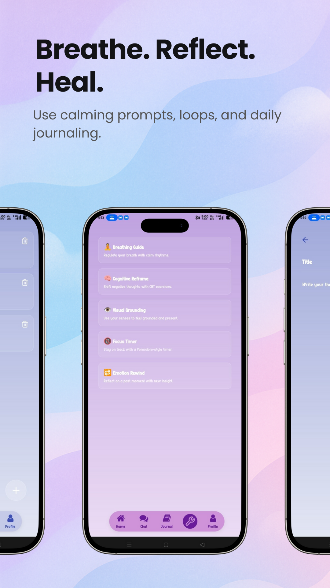

<p align="center">
  
</p>

<h1 align="center">🌿 Serava – Your AI-Powered Mental Health Companion</h1>

<p align="center">
  <em>A sanctuary in your pocket, Serava is always kind, always present, always evolving with you.</em>
</p>

## 🌈 Overview

**Serava** isn't just another chatbot. It's your mood-aware, emotionally intelligent AI friend designed to support your mental well-being through empathy, mindfulness, and personalization.

Whether you're feeling lost, anxious, overwhelmed, or simply want a grounding exercise, Serava adapts to what _you_ need in the moment—offering a calming presence, motivational support, or a gentle nudge toward self-reflection.


## ✨ Features

- 🎭 **Mood-Aware Conversations** – Real-time mood detection shapes the UI and chatbot tone.
- 🧠 **Emotionally Intelligent AI** – Built using advanced LLMs with emotional nuance and personalized memory.
- 📱 **Dynamic Theming** – UI that adapts colors/fonts based on your emotional state.
- ♻ **Mindfulness Loops** – Grounding exercises, journaling prompts, and calming flows.
- 💬 **Self-Care Toolbox** – Tools for breathwork, focus, reflection, and motivation.
- 🧘 **Offline Mode** – Access core wellness tools even without internet.
- 🔒 **Secure & Private** – Data encrypted and stored with Firebase.


## 💡 The Problem It Solves

> Many people struggle silently with anxiety, burnout, and emotional turmoil. Not everyone can or wants to reach out. Serava steps in with 24/7 support, not to replace therapy, but to **bridge the gap** between daily struggles and professional help.


## 🌟 Target Audience

- College students under academic pressure
- Remote workers feeling disconnected or burned out
- Anyone struggling with anxiety, overthinking, or emotional overwhelm
- People seeking consistent, non-judgmental emotional support

## 🌟 Mockups

<style>
  .scroll-wrapper {
    overflow-x: auto;
    overflow-y: hidden;
    white-space: nowrap;
    cursor: grab;
    scroll-behavior: smooth;
    -ms-overflow-style: none;  /* IE and Edge */
    scrollbar-width: none;     /* Firefox */
  }

  .scroll-wrapper::-webkit-scrollbar {
    display: none;             /* Chrome, Safari */
  }

  .scroll-wrapper:active {
    cursor: grabbing;
  }

  .scroll-wrapper img {
    display: inline-block;
    margin-right: 1rem;
    user-select: none;
    pointer-events: none;
  }
</style>

<div class="scroll-wrapper" id="scroll-wrapper">
  
  
  
  
</div>

<script>
  const slider = document.getElementById('scroll-wrapper');
  let isDown = false;
  let startX;
  let scrollLeft;

  slider.addEventListener('mousedown', (e) => {
    isDown = true;
    slider.classList.add('active');
    startX = e.pageX - slider.offsetLeft;
    scrollLeft = slider.scrollLeft;
  });

  slider.addEventListener('mouseleave', () => {
    isDown = false;
    slider.classList.remove('active');
  });

  slider.addEventListener('mouseup', () => {
    isDown = false;
    slider.classList.remove('active');
  });

  slider.addEventListener('mousemove', (e) => {
    if (!isDown) return;
    e.preventDefault();
    const x = e.pageX - slider.offsetLeft;
    const walk = (x - startX) * 1.5;
    slider.scrollLeft = scrollLeft - walk;
  });
</script>


## 🧹 Tech Stack

| Layer              | Tech Used                                          |
| ------------------ | -------------------------------------------------- |
| **Frontend**       | Expo React Native, Tailwind (NativeWind)           |
| **Backend**        | Firebase                                           |
| **AI/NLP**         | Gemini API for conversational intelligence         |
| **Mood Detection** | Emotion analysis via free NLP/emotion libraries    |
| **Voice & Input**  | Optional integration with Mozilla DeepSpeech       |
| **Design**         | Figma, Midjourney for assets, custom illustrations |


## 🗾 Architecture


## 📏 User Flow


## ⚙️ Getting Started

1. Clone the repo:

   ```bash
   git clone https://github.com/MohdAqdasAsim/Serava.git
   cd Serava
   ```

2. Install dependencies:

   ```bash
   npm install
   ```

3. Run the app locally:
   ```bash
   npx expo start
   ```

## 📄 License

MIT © [Mohd Aqdas Asim]. Feel free to use, fork, and remix with attribution.

## 📨 Stay Connected

Follow our journey on:

- 🌐 Website (coming soon!)
- 📸 Instagram @serava.app
- 🧠 Medium Blog (mental health & dev diaries)

> _"Mental health matters, and so do you."_